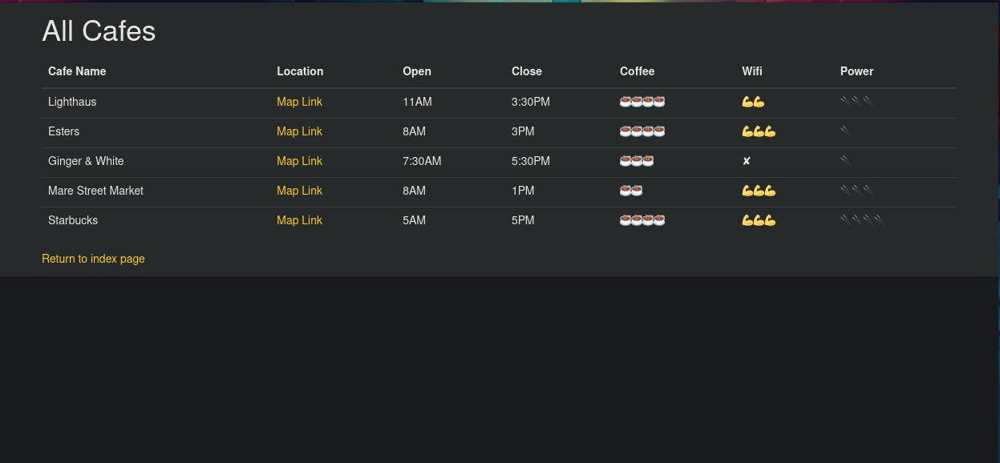
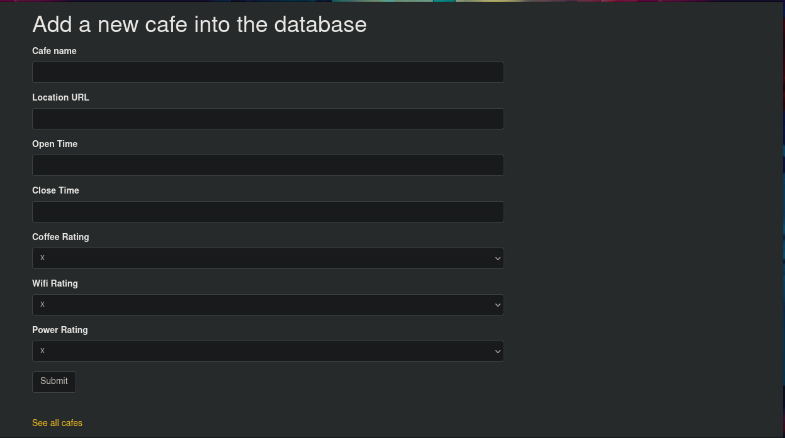

# Café Review App

A Flask web application that allows users to add and view café reviews.


## Features

- Add new café with its details including name, location URL, opening time, closing time, and ratings for coffee, Wi-Fi, and power availability.
- View a list of all the cafes added to the system.
- Built using Flask and Flask-Bootstrap for styling.

## Installation and Setup

1. Clone the repository:
   ```
   git clone https://github.com/j-breedlove/cafe_wifi_rater_flask.git
   ```

2. Navigate to the project directory:
   ```
   cd cafe_wifi_rater_flask
   ```

3. Install the required dependencies:
   ```
   pip install pipenv
   pipenv install
   pipenv shell
   ```

4. Run the application:
   ```
   python app.py
   ```

5. Open your browser and go to `http://127.0.0.1:5000/` to view the app.

## Contributing

Pull requests are welcome. For major changes, please open an issue first to discuss what you would like to change.
